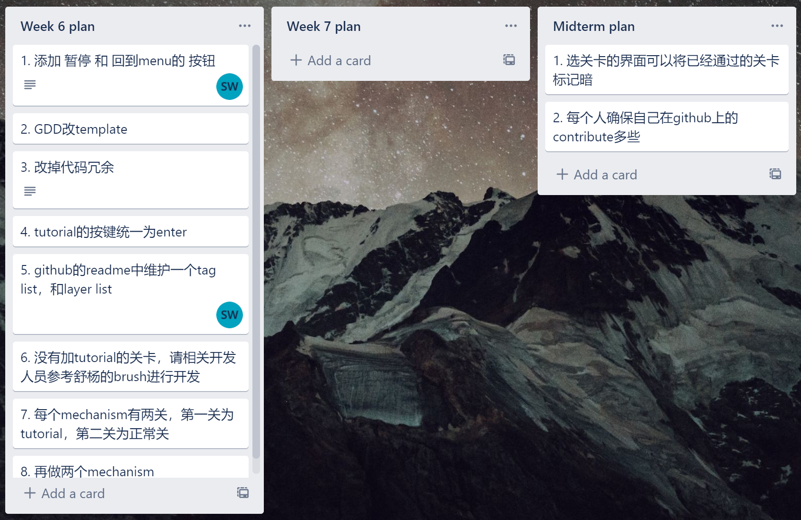
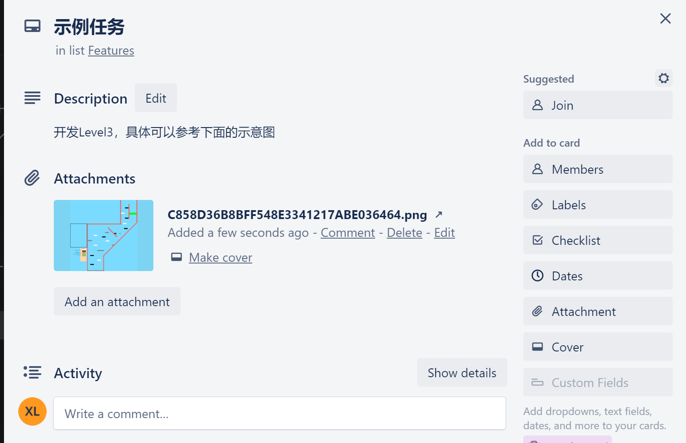
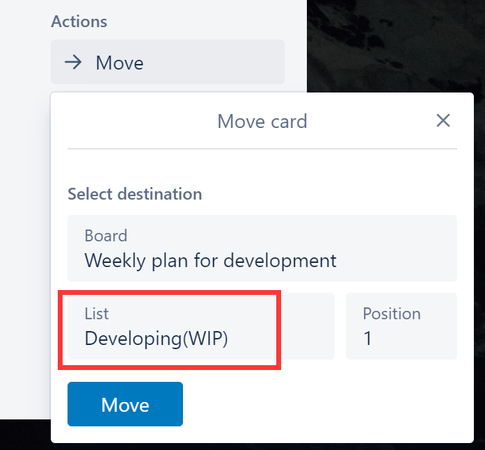
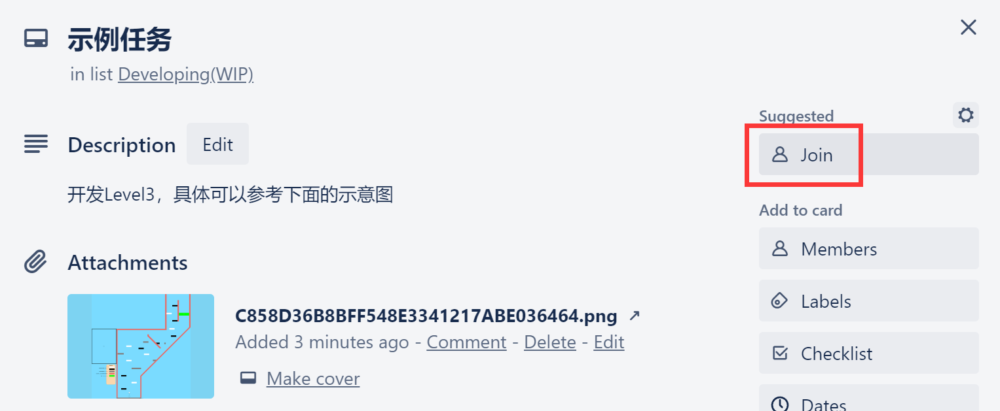
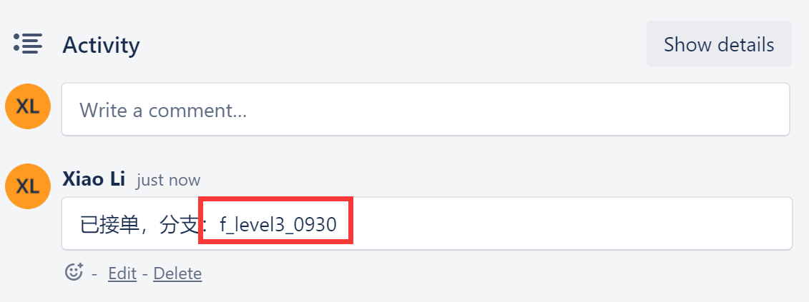
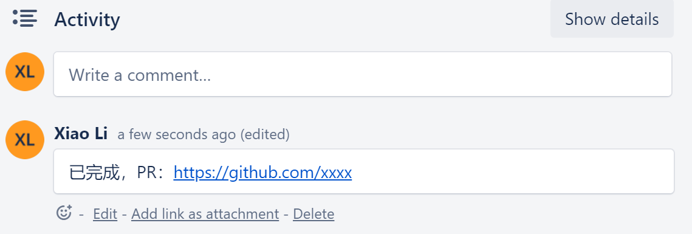
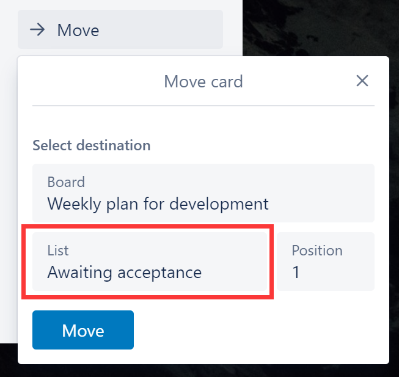
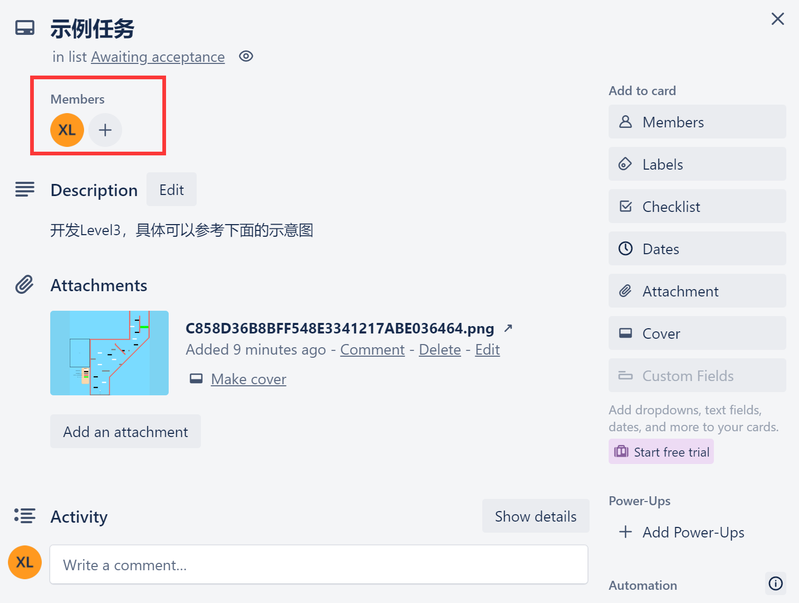

# 项目开发建议

#### 目录：

- [项目开发建议](#项目开发建议)
      - [目录：](#目录)
  - [Trello](#trello)
    - [基本流程](#基本流程)
    - [创建任务](#创建任务)
    - [开发任务](#开发任务)
    - [验收任务](#验收任务)
    - [完成任务](#完成任务)
  - [Github](#github)
    - [代码开发流程](#代码开发流程)
    - [分支的命名规范](#分支的命名规范)
    - [Pull Request](#pull-request)

## Trello

### 基本流程

创建任务卡(提单) -> 开发任务(做单) -> 验收任务(测试) -> 完成任务(关单) 

### 创建任务

1. \* plan：我们在***plan当中记录某周或者某个时间节点之前的一些要点任务，这些任务可以是比较宽泛的描述，不需要有具体的代码功能描述。如下：

   

   而后，由project manager(?)将这些genaral的文字任务拆分成具体的任务，移动到Features或者Bugs中

2. Features：我们在Features当中记录需要实现的新feature，这些新feature可以是新的Mechanism，可以是新关卡等等。需要比较具体的描述：新关卡可以是关卡的图片(drawio)，新feature可以是feature的一个构思图

   

3. Bugs：我们在Bugs当中记录发现和需要处理的Bug以及一切不需要开发新功能的任务，包括一些代码重构相关的工作。这些bug需要有具体的文字描述或者图片视频表现，以及Bug复现方法等等。

### 开发任务

当任务被发布到Features或者Bugs上时，可以任意组员按照意愿领取，并且按照下面的步骤操作：

1. 移动任务单到Developing(WIP)

   

2. 将自己加入到单中（Join)

   

3. 贴上你开发的分支名称：

   

### 验收任务

1. 当任务开发完毕后，提交pull request，并且将单子移动到Awaiting acceptance

   

   

2. 由测试人员（Pm或者任意一个开发人员以外的人）接手测试，将自己Join到member中表示自己正在测试，以防多个人同时测试同一个单子浪费时间。

   

### 完成任务

测试完成后，将任务移动到Finished中存档，以完成每周的任务表格，同时Github可以以此列表为参考来合并分支。

## Github

### 代码开发流程

所有新功能开发或者bug修改，都必须新建分支，再合入develop分支

举例：要新开发关卡 “level3”

先在develop分支上创建新分支f_level3_0930，修改完后，再把分支合并到develop，相关shell如下：

```shell
git checkout -b f_modify_doc_0819

...

git add .

git commit –m "level3"

git push –u origin f_modify_doc_0819
```

打开生成的网址链接，在web上提交合并流程，通过后回到develop再拉取提交:

```shell
git checkout develop

git pull
```

### 分支的命名规范

分支名格式：标识功能时间，如：level3开发f_level_0930， level3 bug修改分支b_level3_0930

标识：f表示feature, b表示bug, 结尾日期以MMDD结尾。

### Pull Request

所有的新功能以及bug修复都必须提交pull request合并到develop分支，同时需要自行**解决冲突**。必须由开发者**自己手动测试一遍所有其它关卡保证不影响其他人的工作**，Pull Request的文字描述中建议附上自己开发完成的**webgl链接**供测试人员测试。